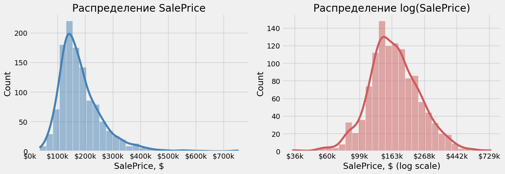
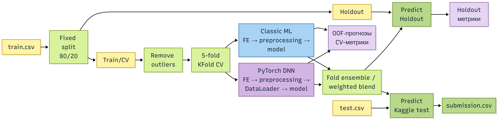
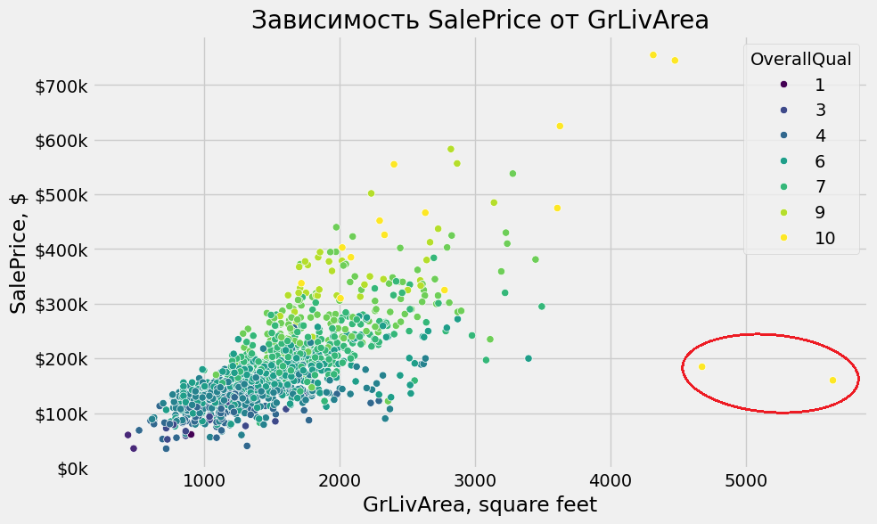
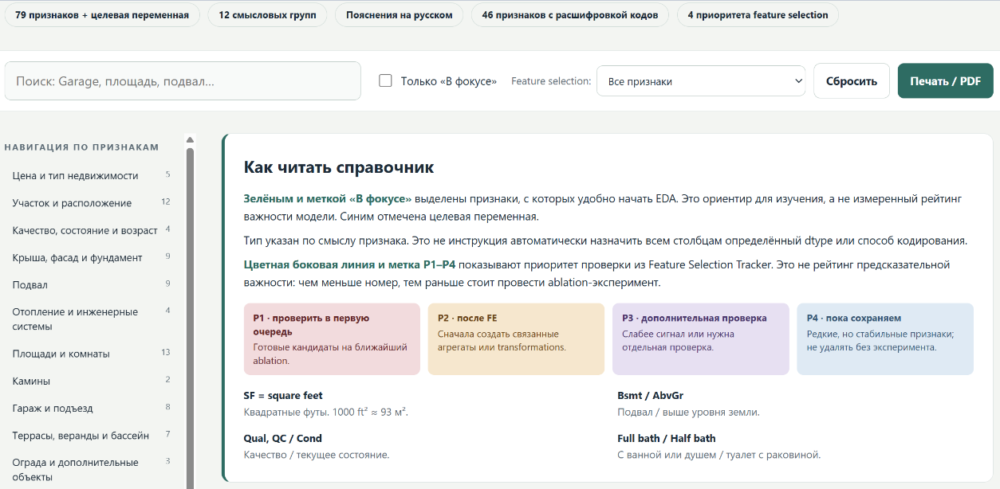
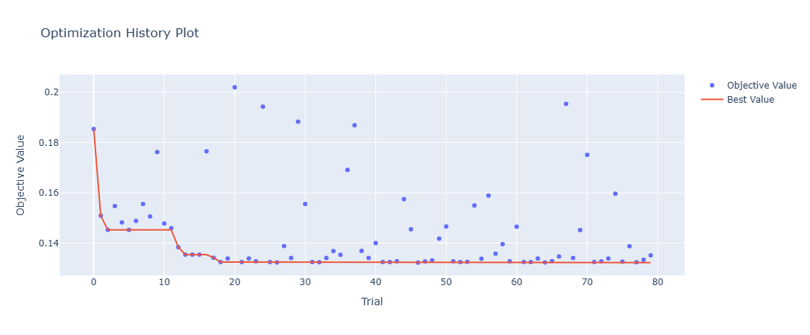
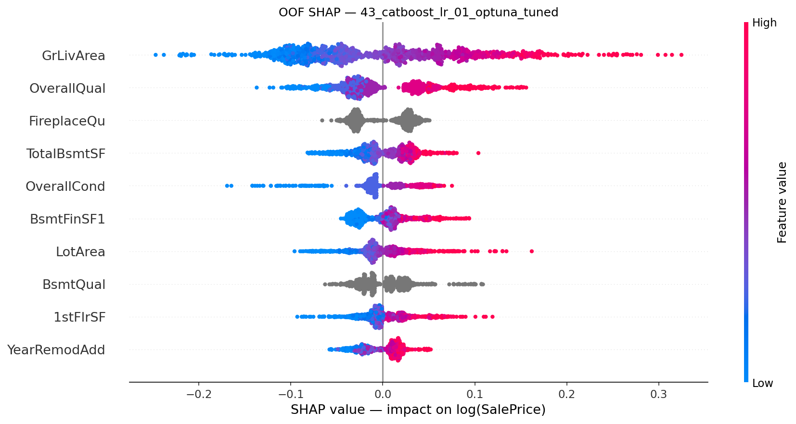
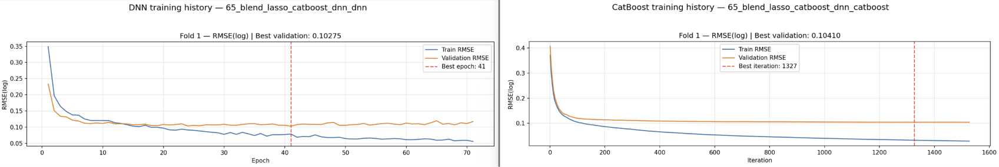

# Прогнозирование стоимости домов в Ames

Учебный проект по построению воспроизводимого end-to-end pipeline для задачи регрессии из соревнования [House Prices — Advanced Regression Techniques](https://www.kaggle.com/competitions/house-prices-advanced-regression-techniques).

Главная цель проекта - не только получить хорошее качество прогнозирования, но и последовательно пройти полный цикл разработки ML-решения: исследование данных, построение валидации, preprocessing, feature engineering, сравнение моделей, подбор гиперпараметров, анализ ошибок, интерпретация результатов и построение ансамбля.

В ходе проекта проведено более 60 экспериментов. Были исследованы линейные модели, Random Forest, CatBoost, XGBoost, KNN и DNN на PyTorch. Финальное решение представляет собой weighted blend трёх разнородных моделей: Lasso, CatBoost и DNN.

Основной локальной метрикой выбрана `RMSE(log)`, соответствующая логарифмической шкале целевой переменной и метрике соревнования. Качество оценивается с помощью 5-fold Cross-Validation, OOF-предсказаний, отдельной holdout-выборки и Kaggle Public Leaderboard.

### Ключевые результаты

- Финальный ансамбль: **CV RMSE(log) 0.10561 ± 0.00968**, Holdout **0.10942**, Kaggle LB **0.12314**.
- Лучший одиночный CV: **Lasso - 0.11035 ± 0.01054**.
- Лучший Kaggle LB: **CatBoost - 0.12246**.
- Состав финального ансамбля: **Lasso 0.400 + CatBoost 0.275 + DNN 0.325**.


## 1. Быстрый запуск

```bash
git clone https://github.com/AntonUkhabin/House_Prices_Kaggle.git
cd House_Prices_Kaggle

conda create -n house_prices python=3.14
conda activate house_prices
python -m pip install -r requirements.txt

python main.py
```

Датасет уже находится в каталоге `data`.

Перед запуском в `config.py` необходимо задать уникальное `experiment_name` и выбрать `model.active`.

Доступные модели: `linear_regression`, `ridge`, `lasso`, `elastic_net`, `random_forest`, `catboost`, `xgboost`, `dnn`, `blend`.

`main.py` запускает полный pipeline: Cross-Validation, обучение, оценку на holdout и создание `outputs/submissions/<experiment_name>.csv`. Логи, OOF-прогнозы, ошибки моделей, графики и checkpoints сохраняются в каталоге `outputs`.

Каталог `outputs` не хранится в Git и создаётся автоматически во время выполнения pipeline.

## 2. Данные и метрика

Датасет содержит 1460 обучающих и 1459 тестовых объектов с 79 входными признаками: 35 числовыми и 44 категориальными. `Id` используется только для идентификации объектов, целевая переменная - `SalePrice`.

Из-за выраженной правой асимметрии `SalePrice` модели обучаются на `np.log(SalePrice)`, а итоговые прогнозы возвращаются в исходную шкалу с помощью `np.exp`.



Основная метрика - `RMSE(log)`, соответствующая метрике соревнования. Дополнительно рассчитываются MAE, RMSE, R², MAPE, SMAPE и WAPE в исходной шкале цен.

## 3. Валидация и общий pipeline

Исходная обучающая выборка сначала разделяется на train/CV и фиксированный holdout размером 20%. После разделения из train/CV исключаются два подтверждённых EDA-outlier, при этом holdout остаётся неизменным.



Для Cross-Validation используется `KFold` с shuffle и фиксированным seed. Preprocessing и модель обучаются независимо внутри каждого fold, что предотвращает data leakage.

Каждый объект train/CV получает одно OOF-предсказание. Прогнозы для holdout и test формируются усреднением предсказаний пяти fold-моделей. Для blend сначала усредняются fold-предсказания каждого компонента, после чего результаты Lasso, CatBoost и DNN объединяются с заданными весами в log-space.

## 4. EDA и обзор признаков

Датасет содержит множество связанных характеристик недвижимости: площадь, качество строительства, состояние подвала и гаража, расположение, год постройки и условия продажи.

Основные выводы EDA:

- наиболее сильная связь с ценой наблюдается у `OverallQual`, `GrLivArea`, `GarageCars`, `GarageArea`, `TotalBsmtSF`, `YearBuilt` и `YearRemodAdd`;
- многие пропуски означают отсутствие объекта, например подвала, гаража, камина или бассейна, и обрабатываются отдельно от настоящих missing values;
- подробный анализ распределений, корреляций, пропусков и выбросов находится в `[EDA.ipynb](./EDA.ipynb)`.

Во время EDA дома `Id=524` и `Id=1299` были выделены как кандидаты на удаление из-за аномально низкой цены относительно жилой площади и качества строительства.



В контролируемом сравнении Ridge удаление этих объектов снизило CV RMSE(log) с `0.14847` до `0.11935` на **19.6%**, RMSE(log) на неизменном holdout с `0.12401` до `0.11736`, или на **5.4%**, а CV STD на **63%**. Часть улучшения CV связана с исключением двух сложных объектов из OOF-оценки, поэтому результат на неизменном holdout является более надёжным подтверждением эффекта. После этой проверки удаление было зафиксировано только для train/CV.

Для работы с большим количеством признаков был подготовлен отдельный интерактивный HTML-справочник. Он содержит описание 79 входных признаков и target, расшифровку категориальных значений, разделение на 12 смысловых групп и четыре рабочих приоритета для feature selection.

Приоритеты отражают исследовательские гипотезы, а не окончательный рейтинг важности признаков.



[Открыть полный HTML-справочник](https://antonukhabin.github.io/House_Prices_Kaggle/assets/house_prices_feature_guide.html)

## 5. Preprocessing и Feature Engineering

Все обучаемые преобразования выполняются независимо внутри каждого fold, поэтому статистики imputation, scaling и категориального encoding не используют validation-часть.

Пропуски, обозначающие отсутствие объекта, обрабатываются отдельно от неизвестных значений. Например, для домов без гаража, подвала, камина или бассейна создаются категории `NoGarage`, `NoBasement`, `NoFireplace` и `NoPool`.

Preprocessing адаптирован под особенности моделей:


| Модели        | Числовые признаки                     | Категориальные признаки                    |
| ------------- | ------------------------------------- | ------------------------------------------ |
| Linear Models | median imputation, StandardScaler     | most frequent imputation, One-Hot Encoding |
| Random Forest | constant imputation                   | `Unknown`, One-Hot Encoding                |
| CatBoost      | исходная шкала, native missing values | native categorical features                |
| XGBoost       | исходная шкала, native missing values | `Unknown`, One-Hot Encoding                |
| DNN           | median imputation, StandardScaler     | индексы категорий и trainable embeddings   |


Для `LotArea`, `LotFrontage`, `1stFlrSF` и `GrLivArea` применяется `log1p`, уменьшающий правую асимметрию распределений. CatBoost и XGBoost получают эти признаки в исходной шкале, поскольку деревья не требуют нормализации распределения.

Для Classic ML используется зафиксированный набор признаков, полученный в серии экспериментов с последовательным удалением отдельных признаков и смысловых групп. DNN, напротив, показала лучший результат на полном наборе исходных признаков, поэтому для неё feature selection не применяется.

В рамках Feature Engineering были проверены признаки возраста дома, суммарной площади, количества ванных комнат и индикаторы наличия отдельных объектов. Они не улучшили Cross-Validation, поэтому в финальном pipeline сохранены только подтверждённые преобразования исходных признаков.

## 6. Модели

Эксперименты проводились последовательно: от `Linear Regression` и регуляризованных линейных моделей `Ridge`, `Lasso`, `ElasticNet` к Random Forest, градиентным бустингам CatBoost и XGBoost и табличной DNN на PyTorch. Все модели обучаются предсказывать `log(SalePrice)` и сравниваются на одинаковых CV-fold.

В финальный blend вошли три наиболее полезные и разнородные модели:

- **Lasso** с `alpha=0.000225` - лучший одиночный результат по Cross-Validation;
- **CatBoost** с неглубокими деревьями и early stopping - лучший одиночный результат на Kaggle Public Leaderboard;
- **DNN**: numerical features + categorical embeddings → `64 → 32 → 16 → 1`, `AdamW` и early stopping.

На локальной оценке DNN заняла второе место среди одиночных моделей, уступив только Lasso и превзойдя CatBoost по Cross-Validation и holdout. При этом CatBoost оказался сильнее на Kaggle Public Leaderboard. Различия между ошибками трёх моделей позволили улучшить результат с помощью blend.

## 7. Эксперименты и выводы

В ходе проекта проведено более 60 экспериментов. Основные гипотезы проверялись на одинаковых фиксированных CV-fold, что позволяло корректно сравнивать изменения preprocessing, признаков и моделей.

### Подбор гиперпараметров

Для Random Forest, CatBoost и XGBoost использовалась оптимизация гиперпараметров с помощью Optuna. Целевой функцией служил средний RMSE(log) на пяти CV-fold. Параметры линейных моделей и DNN подбирались последовательными контролируемыми экспериментами.

Optuna помогла определить наиболее перспективные диапазоны параметров, однако найденные конфигурации дополнительно проверялись повторной Cross-Validation и сравнивались с baseline.

Пример оптимизации Random Forest с помощью Optuna:



[Открыть график важности гиперпараметров](./assets/optuna_rf_importance.png)

### Что улучшило результат

- удаление двух подтверждённых EDA-outlier из train/CV;
- `log1p` для `LotArea`, `LotFrontage`, `1stFlrSF` и `GrLivArea`;
- последовательное удаление слабых и избыточных признаков для Classic ML;
- настройка регуляризации Lasso и параметров boosting-моделей;
- возврат полного набора исходных признаков для DNN.

Особенно показателен последний результат: feature selection помог линейным моделям и tree ensembles, но заметно ухудшил DNN. Нейронная сеть эффективнее использовала слабые признаки совместно, чем по отдельности.

### Что не улучшило результат

- добавление missing indicator к медианному заполнению `LotFrontage` и заполнение медианой по `Neighborhood`;
- `QuantileTransformer` для Linear Models и DNN;
- дополнительные `log1p`-преобразования признаков с большим количеством нулей;
- признаки возраста дома, суммарной площади, количества ванных комнат и structural indicators;
- полный набор признаков для Random Forest и CatBoost;
- более глубокие деревья CatBoost;
- scheduler и дополнительный Feature Engineering для DNN;
- удаление DNN-признаков по результатам Permutation Importance;
- KNN как самостоятельная модель и компонент ансамбля.

Дополнительно тестировалась функция `reduce_mem_usage`. Первоначальная оценка показывала сокращение памяти на 34%, но после использования `memory_usage='deep'`, учитывающего строковые данные, реальная экономия составила около 10%. Поскольку последующие sklearn-преобразования создают новые массивы, для небольшого датасета предварительный downcasting не оправдал дополнительного усложнения pipeline.

Отсутствие улучшения также считалось полезным результатом: такие эксперименты помогли сохранить финальный pipeline компактным и отказаться от преобразований, которые увеличивали сложность без устойчивого прироста качества.

## 8. Интерпретация и диагностика моделей

Интерпретация рассчитывалась на OOF-части данных: каждый объект анализировался моделью, которая не использовала его при обучении. Это позволяет исследовать поведение моделей на незнакомых данных, а не только объяснять уже выученные наблюдения.

### SHAP

Для CatBoost были рассчитаны OOF SHAP values и объединены результаты пяти fold. Наибольшее влияние на прогноз оказывают жилая площадь, общее качество дома, характеристики подвала, участка, гаража и год постройки.



[Открыть ранжирование признаков по среднему абсолютному SHAP value](./assets/shap_feature_importance_top10.png)

Высокие значения `GrLivArea`, `OverallQual`, `TotalBsmtSF`, `LotArea` и `1stFlrSF` в основном увеличивают прогнозируемую стоимость. SHAP подтвердил основные выводы EDA, но дополнительно показал направление и распределение влияния признаков на прогноз модели.

### Permutation Importance и анализ ошибок

Для Lasso и DNN реализован OOF Permutation Importance. Значение признака определяется по изменению RMSE(log) после его перемешивания внутри validation-части каждого fold. Итоговый отчёт содержит среднюю важность, разброс между повторами и стабильность результата между fold.

Permutation Importance использовался как диагностический инструмент, а не как автоматическое правило feature selection. Удаление слабых и отрицательных по отдельности DNN-признаков ухудшило Cross-Validation, поскольку метод не полностью учитывает зависимости, корреляции и совместное использование признаков нейронной сетью.

[Открыть Permutation Importance для Lasso](./assets/lasso_permutation_importance.csv) ·
[Открыть Permutation Importance для DNN](./assets/dnn_permutation_importance.csv)

Для каждого эксперимента также сохраняются OOF-предсказания и таблица объектов с наибольшими ошибками. Такой анализ помог сравнить не только итоговые метрики моделей, но и различия в характере их ошибок.

### Диагностика обучения

Для CatBoost и DNN сохраняются train/validation curves каждого fold. Пунктирной линией отмечается итерация или эпоха с минимальным validation RMSE, соответствующее состояние модели используется для прогнозирования.



[Открыть полную историю DNN](./assets/dnn_training_history.png) ·
[Открыть полную историю CatBoost](./assets/catboost_training_history.png)

## 9. Blending

Финальное решение объединяет три разнородные модели:

```text
0.400 × Lasso + 0.275 × CatBoost + 0.325 × DNN
```

Веса подбирались grid search по OOF-предсказаниям train/CV при ограничениях `weight ≥ 0` и `sum(weights) = 1`. Несколько соседних комбинаций показали практически одинаковый результат, поэтому выбранные веса рассматриваются как практический вариант вблизи оптимума, а не как единственное точное решение.

Предсказания объединяются в log-space:

```text
blend_log = 0.400 × lasso_log
          + 0.275 × catboost_log
          + 0.325 × dnn_log

SalePrice = exp(blend_log)
```

Для OOF каждый объект получает по одному прогнозу каждого компонента. Для holdout и `test.csv` сначала усредняются прогнозы пяти fold-моделей внутри каждого компонента, после чего применяются model-level weights. Всего финальный ансамбль использует 15 обученных моделей.

Различия между компонентами подтверждаются корреляцией их OOF-ошибок:


| Пара моделей     | Корреляция OOF-ошибок |
| ---------------- | --------------------- |
| Lasso - CatBoost | 0.842                 |
| Lasso - DNN      | 0.836                 |
| CatBoost - DNN   | 0.822                 |


[OOF-ошибки Lasso](./assets/lasso_oof_errors.csv) ·
[OOF-ошибки CatBoost](./assets/catboost_oof_errors.csv) ·
[OOF-ошибки DNN](./assets/dnn_oof_errors.csv)

Ошибки моделей совпадают не полностью: CatBoost и DNN образуют наиболее разнородную пару, а Lasso добавляет устойчивую линейную составляющую. Их объединение уменьшило влияние отдельных неудачных прогнозов и улучшило локальные метрики относительно каждого компонента.

## 10. Итоговые результаты

В таблице приведены лучшие конфигурации основных подходов. Главным критерием выбора служил средний RMSE(log) на Cross-Validation. Holdout использовался для отдельной локальной проверки, а Kaggle Public Leaderboard как дополнительная внешняя оценка.


| Model                      | Experiment | CV RMSE(log) | CV STD  | Holdout   | Kaggle LB |
| -------------------------- | ---------- | ------------ | ------- | --------- | --------- |
| Lasso                      | 35         | 0.11035      | 0.01054 | 0.11195   | 0.12934   |
| Random Forest              | 38         | 0.13226      | 0.01038 | 0.13534   | 0.14465   |
| CatBoost                   | 43         | 0.11364      | 0.00779 | 0.11452   | `0.12246` |
| XGBoost                    | 46         | 0.11401      | 0.00695 | 0.11685   | 0.13211   |
| KNN                        | 48         | 0.16338      | 0.00608 | 0.16091   | 0.16959   |
| DNN                        | 57         | 0.11272      | 0.00824 | 0.11244   | 0.12683   |
| **Lasso + CatBoost + DNN** | **65**     | `0.10561`    | 0.00968 | `0.10942` | 0.12314   |


Финальный blend улучшил результат лучшей одиночной модели Lasso на **4.3% по Cross-Validation** и на **2.3% на holdout**. Улучшение на фиксированном holdout подтверждает, что выигрыш ансамбля не ограничивается только OOF-выборкой.

При этом лучший результат на Kaggle Public Leaderboard сохранил CatBoost - `0.12246` против `0.12314` у blend. Различие небольшое, однако оно показывает, что преимущество локального ансамбля не обязано полностью воспроизводиться на отдельной leaderboard-выборке.

DNN заняла второе место среди одиночных моделей по CV и holdout, а CatBoost оказался сильнее остальных одиночных моделей на Kaggle. Random Forest и особенно KNN заметно уступили более подходящим для этой задачи линейным, boosting- и neural-подходам.

### Практический выбор

Если приоритетом являются простота, скорость и удобство сопровождения, Lasso остаётся наиболее рациональным решением: она требует только одного preprocessing pipeline, быстро обучается и уступает ансамблю всего `0.00253` RMSE(log) на holdout.

Blend оправдан, когда важнее максимальное локальное качество: он улучшил CV на 4.3% и holdout на 2.3%, но требует обучения и хранения 15 fold-моделей трёх разных архитектур.

Для учебного проекта ансамбль выбран финальным решением, поскольку он не только улучшил локальные метрики, но и демонстрирует полноценную работу с OOF-предсказаниями, разнородными моделями и многоуровневым inference. В более простом production-сценарии Lasso могла бы оказаться предпочтительнее по соотношению качества и сложности.

## 11. Архитектура и структура проекта

`main.py` служит единой точкой запуска pipeline, а параметры данных, моделей, валидации, blending и сохраняемых артефактов задаются в `config.py`. Логика разделена на небольшие модули по назначению: preprocessing, обучение классических моделей и DNN, интерпретация, blending и experiment logging.

Принцип `DRY` применялся там, где обобщение действительно сокращало дублирование. Общие операции вынесены в переиспользуемые функции и transformers, но model-specific preprocessing сохранён в отдельных builder-функциях. Попытка собрать все `ColumnTransformer` через одну универсальную функцию не уменьшила объём кода и сделала различия между моделями менее очевидными, поэтому предпочтение было отдано более явной реализации.

```text
House_Prices_Kaggle/
├── assets/                       # Отобранные материалы для README
├── data/
│   ├── data_description.txt
│   ├── sample_submission.csv
│   ├── test.csv
│   └── train.csv
├── outputs/                      # Создаётся автоматически и не хранится в Git
│   ├── checkpoints/              # Checkpoints DNN
│   ├── holdout/                  # Holdout-предсказания
│   ├── logs/                     # Логи экспериментов
│   ├── oof/                      # OOF-предсказания и ошибки
│   ├── optuna/                   # Результаты Optuna
│   ├── permutation_importance/   # Отчёты Permutation Importance
│   ├── shap/                     # SHAP-визуализации
│   ├── submissions/              # Kaggle submissions
│   └── training_history/         # JSON файлы и визуализация обучения моделей
├── src/
│   ├── blending.py               # Обучение и inference ансамбля
│   ├── data.py                   # Загрузка и разделение данных
│   ├── experiment_logging.py     # Метрики и сохранение артефактов
│   ├── feature_engineering.py    # Пользовательские transformations
│   ├── permutation_importance.py # OOF Permutation Importance
│   ├── preprocessing.py          # Model-specific preprocessing
│   ├── shap_analysis.py          # OOF SHAP для CatBoost
│   ├── torch_models.py           # Архитектура DNN
│   ├── torch_training.py         # Обучение и inference DNN
│   ├── train_functions.py        # CV классических моделей
│   └── utils.py
├── config.py                     # Конфигурация pipeline
├── main.py                       # Единая точка запуска
├── EDA.ipynb                     # Исследовательский анализ
├── draft.ipynb                   # Рабочие эксперименты
├── requirements.txt
└── README.md
```

Каталог `data` сохранён в репозитории для быстрого воспроизведения проекта. Полный `outputs` исключён из Git из-за большого количества промежуточных файлов, а наиболее показательные графики, таблицы и отчёты перенесены в `assets`.

## 12. Основные выводы

- Самый заметный ранний прирост качества дало удаление двух подтверждённых EDA-outlier. Более сложный Feature Engineering оказался менее полезным, чем аккуратная очистка данных и несколько обоснованных преобразований.
- Lasso стала лучшей простой моделью по локальной оценке. Табличная DNN показала конкурентный результат и превзошла CatBoost по CV и holdout, несмотря на небольшой размер датасета.
- Feature selection оказался model-specific: удаление слабых и избыточных признаков помогло Classic ML, тогда как DNN лучше работала с полным набором исходных признаков.
- Единого лидера по всем способам оценки не получилось: blend показал лучшие CV и holdout, а CatBoost сохранил лучший результат на Kaggle Public Leaderboard.
- SHAP и Permutation Importance были полезны для диагностики моделей, но не заменили повторную проверку гипотез с помощью полноценного Cross-Validation.
- Финальный проект представляет собой воспроизводимый end-to-end pipeline с model-specific preprocessing, OOF-оценкой, holdout, интерпретацией, experiment logging и ансамблем разнородных моделей.

